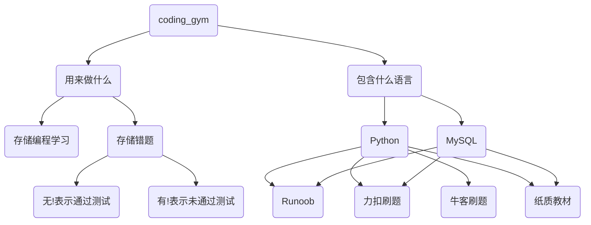

# coding_gym

   Python与SQL练习工作区

```mermaid
graph TD
rt(coding_gym) --> l1(用来做什么)
rt(coding_gym) --> l2(包含什么语言)

l1 --> l11(存储编程学习)
l1 --> l12(存储错题)

l12 --> l121(无!表示通过测试)
l12 --> l122(有!表示未通过测试)

l2 --> l21(Python)
l2 --> l22(MySQL)

l21 --> l211(Runoob)
l21 --> l212(力扣刷题)
l21 --> l213(牛客刷题)
l21 --> l214(纸质教材)

l22 --> l211
l22 --> l212
l22 --> l214
```
